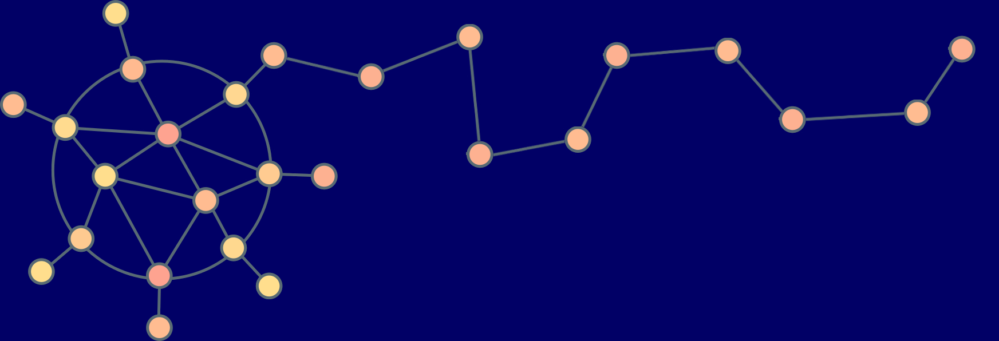
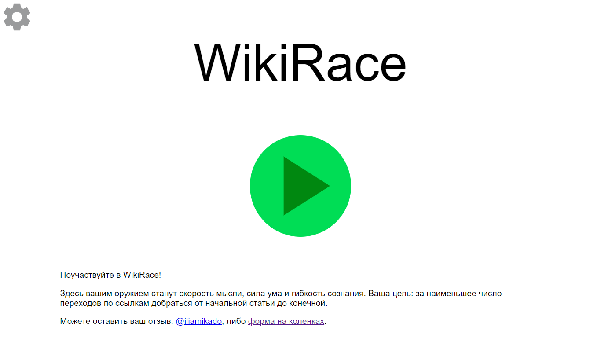
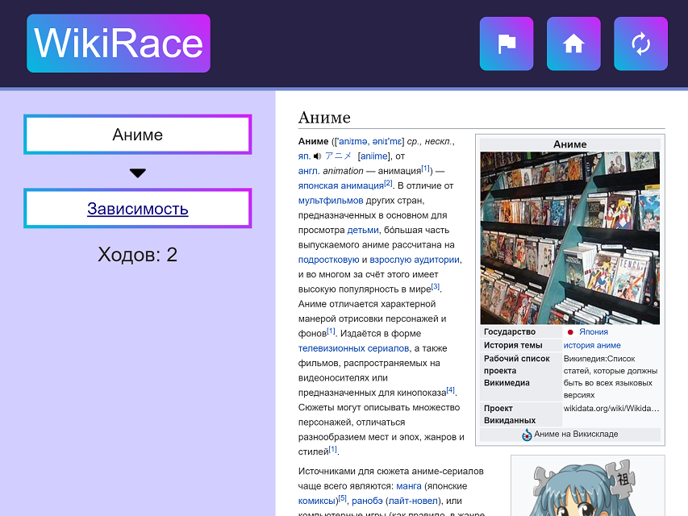

<!-- size: 16:9 -->
<!-- footer: SIS.2019.P -->
<!-- emoji: "twemoji" -->

# <!-- fit --> Привет! :wave:

---
<!-- footer: SIS.2019.P : WikiRace -->

# <!-- fit --> WikiRace

---

# Что такое WikiRace?

- Игра по Википедии
- Цель: дойти от одной статьи до другой по ссылочкам

---

# Чем мы лучше?

* Русский язык Википедии
* "Умная" генерация начальной и целевой страницы, выбор сложности
* Статистика по общим играм, возможность соревноваться с друзьями

---

# Что под капотом?

- Python :snake:
- Django	
* ZIM Архив (**24 GiB**) :floppy_disk:

---

# Возможные сложности и вопросы

- **Огромный** ориентированный невзвешенный граф 
* $1.5 \times 10^6$ вершин, $10^8$ ребер, плотный

---
<!-- footer: SIS.2019.P : WikiRace : Первый выпуск -->

# Первый выпуск

* **6-го июля!** :rocket:
* "Не сканиPовать" не сканируют
* Нет мониторинга ошибок\
Нет статистики по играм\
Нет возможности обратной связи
* Люди играют!

---

# Первый выпуск
<!-- footer: SIS -->

---

# Обратная связь
<!-- footer: SIS.2019.P : WikiRace : Обратная связь -->

Сверхчеловек:
> Крута, респект

\
Злобный хейтер:
> Игра супер класс!

\
петя параллель с:
> ghbdtn)))

---

# Обратная связь

- Дизайн :poop:
- Хочется еще режимов, функций, аниме
- Идейка – огонь :fire:

---
<!-- footer: SIS.2019.P : WikiRace : Новая версия -->

# <!-- fit --> Новая версия

---

# Дизайн
<!-- footer: SIS -->

---

# Дизайн

---

# Сложности
<!-- footer: SIS.2019.P : WikiRace : Сложности -->

- 3 варианта сложности
- Режим случайной игры – случайные шаги при обходе

|Режим               |Гарантируемый путь|
|:-                  |:-                |
|Просто              |2 шага            |
|Нормально           |3-4 шага          |
|Сложно              |не меньше 5 шагов |
|                    |                  |
|Случайно :game_die: |не больше 5 шагов |

---

# Испытания
<!-- footer: SIS.2019.P : WikiRace : Испытания -->

- **Из варяг в греки**
	- Варяги $\to$ Греки
- **По следам ЛКШ**
	- Берендеево болото $\to$ Череповец
- **Путь настоящего программиста**
	- Программирование $\to$ Аниме

---
<!-- footer: SIS -->

---
<!-- footer: SIS.2019.P : WikiRace -->

## <!-- fit --> Не сканиPовать!
